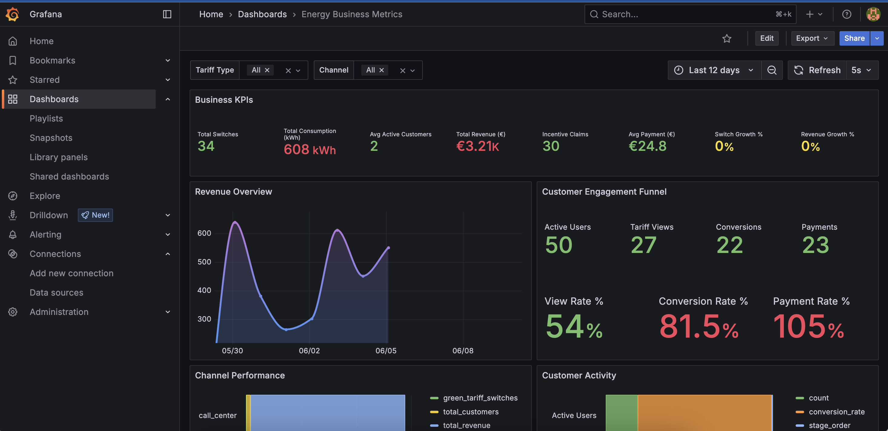

# Energy Data Stream Processing

A real-time streaming pipeline that captures energy consumption and tariff-switching events via Apache Kafka, 
stores them in PostgreSQL, and exposes business intelligence and observability dashboards through Grafana.

This project forms a foundational layer of a large-scale pricing infrastructure I contributed to while 
building experimentation platforms for Pricing teams. It can power key use-cases like dynamic pricing, 
demand elasticity modeling, and A/B test measurement through downstream services.

## Overview

This system implements a modern data architecture for energy business analytics to:

* Track customer energy consumption in real-time
* Measure customer engagement and revenue across tariff-switching and other lifecycle events

### Tech

* Apache Kafka: Event streaming (with sample data) for real-time ingestion
* Python: Event producers and consumers for event processing & metric aggregation
* PostgreSQL: Database for storing raw user events and hourly aggregated business metrics
* Prometheus: Monitoring, alerts, and logging metrics for Kafka (producer and consumer) and application health
* Grafana: Observability dashboards and BI visualizations
* Docker & docker-compose: Containerized development and orchestration
* Pytest: Unit test suite for event producer and consumer

### Architecture

```
   +--------------------+            +----------------+
   |  Event Producer    |  ------>   |     Kafka      |
   |    (events.jsonl)  |            | (producer.py)  |
   +--------------------+            +----------------+
                                         ||
                                         \/
                               +--------------------------------------------+
                               |    Kafka Consumer                          |
                               |  (consumer.py: aggregator + writer)        |
                               +--------------------------------------------+
                               | - ingest_raw_batch() -> events_db.events   |
                               | - process_event() -> flush_business_metrics |
                               |    ->  events_db.hourly_business_metrics   |
                               +--------------------------------------------+
                                         ||
                                         \/
                     +-----------------------------------------------+
                     |     Prometheus + Grafana                      |
                     | - BI Dashboard: Energy Business Metrics       |
                     | - Observability Dashboard: Kafka & DB Metrics |
                     +-----------------------------------------------+
   
```

### BI Dashboards

* Business KPIs: Total switches, consumption, revenue, and growth metrics
* Revenue Overview: Daily revenue trends and patterns
* Customer Engagement Funnel: Conversion rates from active users to payments
* Channel Performance: Multi-channel revenue and customer analysis
* Green Energy Adoption: Cumulative tracking of sustainable energy switches
* Demand Elasticity Analysis: Price sensitivity and demand change patterns
* Dynamic Pricing Insights: Optimal pricing window identification
* Peak Load Management: Energy consumption heatmaps
* A/B Testing Framework: Customer segment analysis and experimentation



### Observability Dashboards

* System Health Monitoring & Metrics (eg. Number of processed events, failed db writes etc.)

## Execution

### Prerequisites

* Python 3.10, Pytest
* Docker and Docker Compose

1. Setup:
```bash
git clone <your-repo-url>
cd energy-data-stream-processing

python -m venv .venv
source .venv/bin/activate
pip install -r requirements.txt
```

2. Run tests:

6 tests pass in each-
```bash
PYTHONPATH=producer pytest -sv tests/test_producer.py

PYTHONPATH=consumer pytest -sv tests/test_consumer.py
```

3. Start the services:
```bash
docker-compose up --build
```

4. Dashboards:

*	Prometheus: http://localhost:9090
*	Grafana: http://localhost:3000 (Default login: `admin/admin`, and then skip password change)
  * Energy Business Metrics: http://localhost:3000/d/energy-business-metrics/energy-business-metrics
  * Kafka & DB Metrics: http://localhost:3000/d/data-ops-dashboard/kafka-and-db-metrics


## Project Details

### Project Structure
```
.
├── producer/                # Kafka producer (simulates events from an event json file)
│   └── producer.py
├── consumer/                # Kafka consumer with core logic to process and validate events
│   └── consumer.py
├── data/                    # Data Source and Error Output 
│   └── events.jsonl         # Sample event data
├── tests/                   # Unit tests for producer and consumer logic
│   └── test_consumer.py
├── monitoring/              # Monitoring setup (Grafana + Prometheus)
│   └── grafana              # Grafana dashboard config
│           └── dashboards
│                   └── dashboard.json      # Metrics dashboard config
│           └── provisioning
│   └── prometheus           # Prometheus config for logs and alerts
├── docker-compose.yml       # For a fully-containerized setup and execution
├── Dockerfile               # Python app
├── requirements.txt         
└── README.md
```

### Design Considerations
* One Kafka topic for all user-energy events (at prototype level)
* Consumer handles event processing, metric aggregation, and flushing to database
  * With a single-thread processor (at prototype level)
* Aggregation = hourly by event type

### Data sources

**Event Types**

* user_login: Customer authentication events
* view_tariffs: Tariff browsing behavior 
* tariff_switch: Tariff change events with revenue impact 
* energy_consumed: Energy consumption measurements 
* incentive_claim: Green energy incentive claims
* bill_payment: Payment processing events

### Data Models: Tables and views

* `events`: Raw event data with customer, channel, and business context
* `hourly_business_metrics`: Aggregated business KPIs by hour
* `customer_view`: Customer profile and segmentation data
* `rolling_24h_metrics`: view
* `daily_event_summary`: view

```
psql -h localhost -p 5432 -U user -d events_db
[user: password]
\d
select * from ...;
```

### Troubleshooting

**Check running containers and logs**
```bash
docker ps -a
docker-compose logs [container]
```

**Notes**

* Wait for a few seconds for the producer and consumer to start generating logs, from docker
* While the metrics dashboards are updated in real-time, a lag of few records is to be expected
* The BI dashboard is for representation purposes, and does not guarantee complete accuracy given the sample data


**Final Logs (Producer)**
```bash
producer-1    | 2025-06-10 03:15:24,679 [INFO] Sent: {'event_type': ..., 'payload': ...}
consumer-1    | 2025-06-10 03:15:24,683 [INFO] Listening to: {'event_type': ..., 'payload': ...}
producer-1    | 2025-06-10 03:15:25,377 [INFO] Finished sending events.
producer-1    | 2025-06-10 03:15:25,378 [INFO] Waiting for final metrics to be scraped...
producer-1 exited with code 0
consumer-1    | 2025-06-10 03:15:48,227 [INFO] Flushed metrics for 10 hours, cleaned up 10 old entries
```

### Future Enhancements
* Add CI workflows for linting, testing, and image validation (e.g., GitHub Actions)
* Introduce async architecture and Kafka schema registry to scale architecture
* Infrastructure-as-code and deployment workflows
* Improved validation with tools like pydantic
